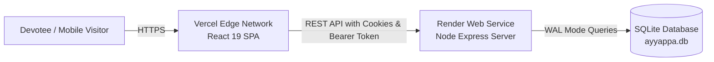

# Deployment Guide: Frontend on Vercel & Backend on Render
## Project: Ayyappa Bhajan Guide (Nellore Pilot)

This repository is pre-configured for deployment with **Render** hosting the Express/SQLite backend and **Vercel** hosting the React/TypeScript frontend.

---

## 1. Deploying the Backend on Render (`server/`)

### Option A: Using the Render Blueprint (Recommended - 1 Click)
1. Push your repository to **GitHub** or **GitLab**.
2. Log in to [Render Dashboard](https://dashboard.render.com/).
3. Click **"New +"** $\rightarrow$ **"Blueprint"**.
4. Select your Ayyappa Bhajan Guide repository.
5. Render will automatically read [`render.yaml`](file:///c:/Ayapa/render.yaml) and configure:
   - Service Name: `ayyappa-bhajan-guide-backend`
   - Runtime: `Node`
   - Build Command: `npm install`
   - Start Command: `node server/index.js`
   - Region: `Singapore` (optimal latency for Andhra Pradesh)
6. Click **"Apply"** to deploy.
7. Once deployed, copy your Render service URL (e.g., `https://ayyappa-bhajan-guide-backend.onrender.com`).

### Option B: Manual Web Service Setup on Render
1. In Render Dashboard, click **"New +"** $\rightarrow$ **"Web Service"**.
2. Connect your Git repository.
3. Configure the service settings:
   - **Name**: `ayyappa-bhajan-guide-backend`
   - **Region**: `Singapore` (or nearest)
   - **Branch**: `master` (or `main`)
   - **Root Directory**: Leave blank (uses repo root)
   - **Runtime**: `Node`
   - **Build Command**: `npm install`
   - **Start Command**: `node server/index.js`
4. Add the following **Environment Variables**:
   | Key | Value / Recommendation |
   | :--- | :--- |
   | `NODE_ENV` | `production` |
   | `PORT` | `10000` |
   | `JWT_SECRET` | Cryptographically random string (e.g. 64 characters) |
   | `ADMIN_USERNAME` | `admin` |
   | `ADMIN_INITIAL_PASSWORD` | Choose a strong password for Super Admin |
   | `CLIENT_ORIGIN` | `https://your-app-name.vercel.app` (Add after Vercel deployment) |
5. Click **"Create Web Service"**.

---

## 2. Deploying the Frontend on Vercel (`client/`)

### Step-by-Step Vercel Setup:
1. Log in to the [Vercel Dashboard](https://vercel.com/).
2. Click **"Add New..."** $\rightarrow$ **"Project"**.
3. Import your Ayyappa Bhajan Guide repository from GitHub.
4. In the **Configure Project** screen:
   - **Framework Preset**: `Vite` (automatically detected)
   - **Root Directory**: Click *Edit* and select **`client`** (or leave as root, as both `client/vercel.json` and root `vercel.json` are pre-configured).
   - **Build Command**: `npm run build`
   - **Output Directory**: `dist`
5. Expand **Environment Variables** and add:
   | Key | Value |
   | :--- | :--- |
   | `VITE_API_URL` | Your Render backend URL (e.g., `https://ayyappa-bhajan-guide-backend.onrender.com`) |
6. Click **"Deploy"**.
7. Vercel will build and deploy your site in ~30 seconds, generating your live URL (e.g., `https://ayyappa-bhajan-guide.vercel.app`).

---

## 3. Post-Deployment Handshake & Verification

### A. Update Backend CORS on Render
1. Go to your Render backend $\rightarrow$ **Environment**.
2. Set `CLIENT_ORIGIN` to your newly created Vercel URL:
   ```
   CLIENT_ORIGIN=https://ayyappa-bhajan-guide.vercel.app
   ```
3. Save changes (Render will automatically redeploy).

### B. Verify Live Operation
1. Open your Vercel URL in your browser.
2. Verify the **🙏 Swamiye Saranam Ayyappa** welcome bar appears.
3. Click **"Play Bhajan"** $\rightarrow$ verify audio playback.
4. Verify upcoming bhajans load from the Render backend.
5. Log in to **Super Admin** $\rightarrow$ verify approval queue, status toggles, and clean demo data action.

---

## 4. Architecture Summary


