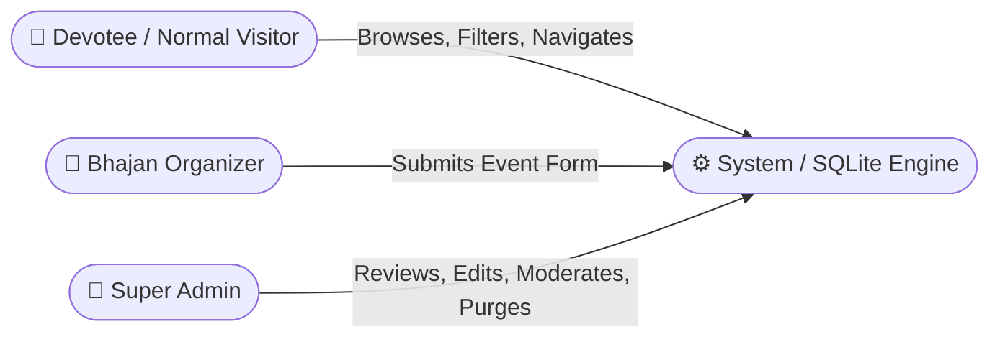
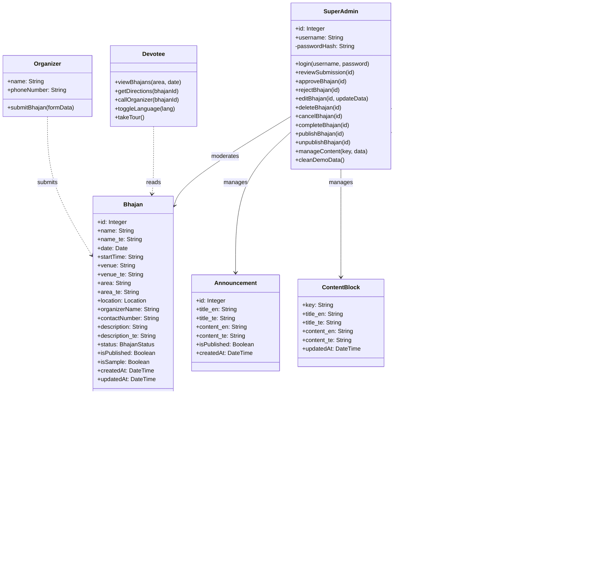
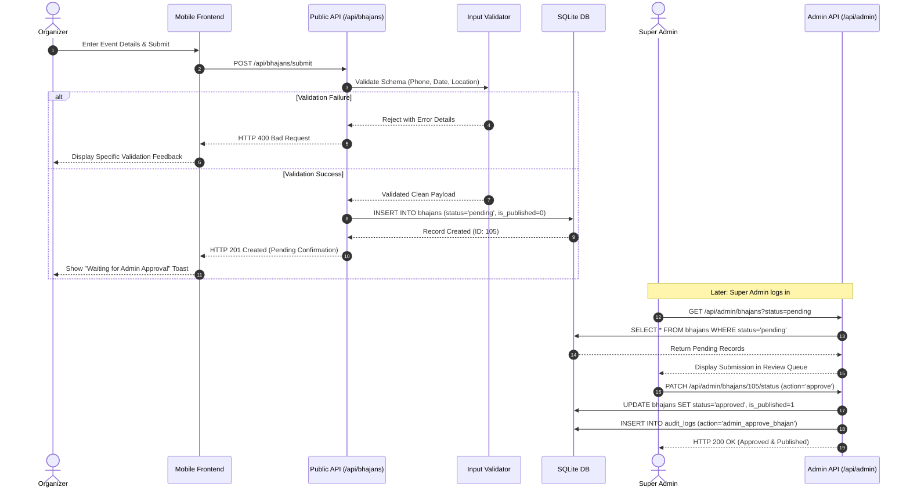
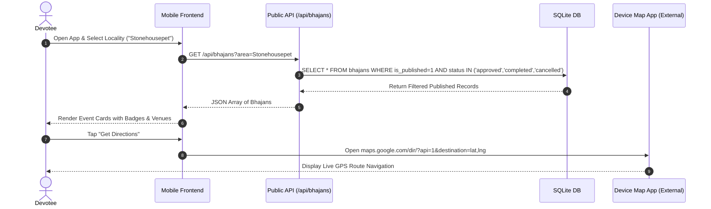
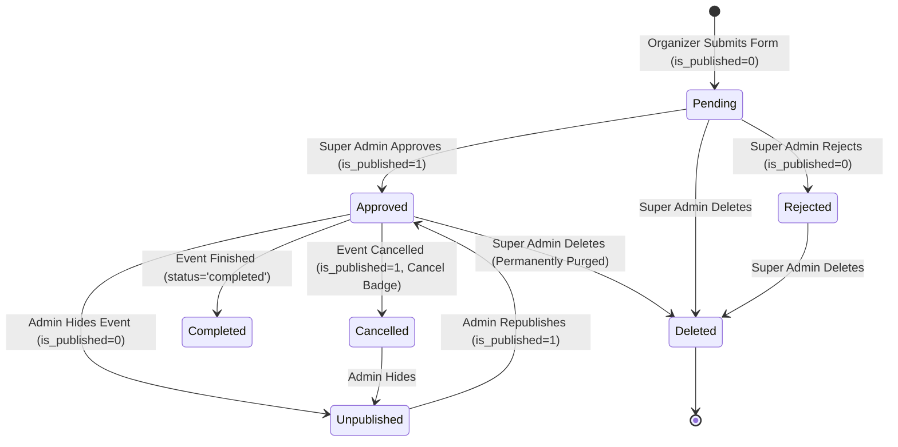

# Object-Oriented Analysis & Design (OOAD) Document
## Project: Ayyappa Bhajan Guide (Nellore Pilot)
**Evaluation Standards**: Unified Modeling Language (UML 2.5) / GRASP Patterns / SOLID Principles  
**Version**: 1.0.0  
**Author / Reviewer**: Software Engineering QA Engineer & OOAD Reviewer

---

## 1. Actor Identification

1. **Devotee / Normal Visitor**: Unauthenticated user searching for bhajans, viewing accurate locations, checking times, reading Maladhari guidance, and navigating via Google Maps.
2. **Bhajan Organizer**: Mandali leader, temple trustee, or devotee submitting upcoming bhajan events for moderation.
3. **Super Admin**: Platform custodian possessing full operational control over submissions, content, announcements, and database hygiene.
4. **System Engine**: Backend process executing validation, SQLite persistence, rate limiting, and session verification.

---

## 2. Domain Entities & Conceptual Class Model

---

## 3. Class Responsibility & Collaborations (CRC Cards)

### 3.1 Class: `Bhajan` (Aggregate Root)
- **Primary Responsibilities**:
  - Encapsulate all event attributes (name, bilingual translations, date, start time, venue, area).
  - Enforce lifecycle state transitions (`pending` -> `approved` -> `completed` / `cancelled`).
  - Maintain the publication invariant (`is_published = 1` only when approved).
  - Preserve source origin flag (`is_sample = 0` vs `1`).
- **Collaborators**: `Location`, `SuperAdmin`, `Organizer`, `AuditLogEntry`.

### 3.2 Class: `Location` (Value Object)
- **Primary Responsibilities**:
  - Encapsulate geographic coordinates and Google Maps URIs.
  - Formulate mobile navigation intent URLs (`https://www.google.com/maps/dir/...`).
  - Validate latitude (-90 to +90) and longitude (-180 to +180) boundary conditions.
- **Collaborators**: `Bhajan`.

### 3.3 Class: `SuperAdmin` (Controller / Custodian)
- **Primary Responsibilities**:
  - Enforce server-side authority over all public data mutations.
  - Approve, reject, edit, or cancel events.
  - Trigger audit log entry creation upon mutation.
- **Collaborators**: `AuthenticationSession`, `Bhajan`, `AuditLogEntry`, `Announcement`, `ContentBlock`.

---

## 4. Sequence Diagrams

### 4.1 Sequence 1: Organizer Submission & Super Admin Moderation

### 4.2 Sequence 2: Devotee Discovery & Navigation

---

## 5. State Machine: Bhajan Lifecycle

### State Invariants:
1. **Public Visibility Invariant**: An event is visible to public queries IF AND ONLY IF `is_published = 1` AND `status IN ('approved', 'completed', 'cancelled')`.
2. **Pending Invariant**: An event in `status = 'pending'` MUST NEVER have `is_published = 1`.
3. **Rejected Invariant**: An event in `status = 'rejected'` MUST NEVER have `is_published = 1`.

---

## 6. Architectural Evaluation (OOAD & Clean Code Findings)

1. **High Cohesion**: 
   - `validator.js` handles pure validation.
   - `auth.js` encapsulates JWT and session decoding.
   - `rateLimiter.js` handles throttling.
2. **Low Coupling**:
   - The React frontend does not possess direct knowledge of the SQLite database. It communicates strictly via standard REST contracts (`/api/*`).
3. **Identified OOAD Code Flaws & Defect Traces**:
   - *State Transition Integrity*: In `PATCH /api/admin/bhajans/:id/status`, calling `publish` on an event currently in `status = 'rejected'` can result in an inconsistent state (`status = 'rejected'` and `is_published = 1`). The state transition method must enforce that only approved events may be published.
   - *Missing Domain Boundary for Dynamic Content*: The `ContentBlock` entity was declared in the database schema but lacks controller endpoints for CRUD operations.
